# Thing Here

Some extra content

## Mathematics

[KaTeX](https://katex.org)

The following is an integral:

$$\int_{a}^{b} x^2 dx$$

Integrate $\int x^3 dx$

## Chemistry

[mhchem](https://mhchem.github.io/MathJax-mhchem)

$\ce{CO2 + C -> 2 CO}$

$\ce{Hg^2+ ->[I-] HgI2 ->[I-] [Hg^{II}I4]^2-}$

$\ce{A <=> B}$

## Mermaid Diagrams

[mermaid](https://mermaid.js.org)

```mermaid
flowchart LR
    id["This ❤ Unicode"]
```




## Penrose Diagrams

[Penrose](https://penrose.cs.cmu.edu)

```
.SUBSTANCE
Set A, B, C, D, E, F, G

Subset(B, A)
Subset(C, A)
Subset(D, B)
Subset(E, B)
Subset(F, C)
Subset(G, C)

Disjoint(E, D)
Disjoint(F, G)
Disjoint(B, C)

AutoLabel All


.STYLE
canvas {
  width = 800
  height = 700
}

forall Set x {
  shape x.icon = Circle { }
  shape x.text = Equation {
    string : x.label
    fontSize : "32px"
  }
  ensure contains(x.icon, x.text)
  encourage norm(x.text.center - x.icon.center) == 0
  layer x.text above x.icon
}

forall Set x; Set y
where Subset(x, y) {
  ensure disjoint(y.text, x.icon, 10)
  ensure contains(y.icon, x.icon, 5)
  layer x.icon above y.icon
}

forall Set x; Set y
where Disjoint(x, y) {
  ensure disjoint(x.icon, y.icon)
}

forall Set x; Set y
where Intersecting(x, y) {
  ensure overlapping(x.icon, y.icon)
  ensure disjoint(y.text, x.icon)
  ensure disjoint(x.text, y.icon)
}


.DOMAIN
type Set

predicate Disjoint(Set s1, Set s2)
predicate Intersecting(Set s1, Set s2)
predicate Subset(Set s1, Set s2)

```
